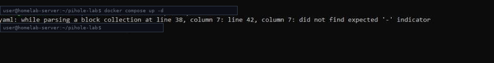
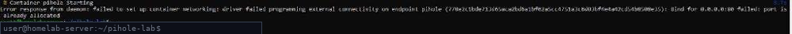
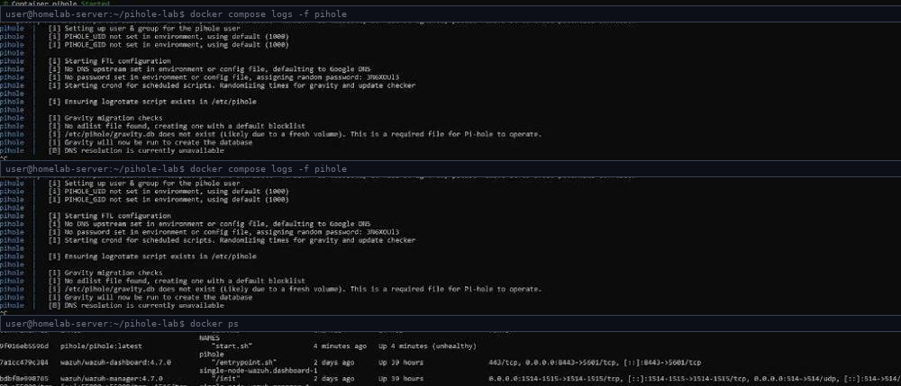
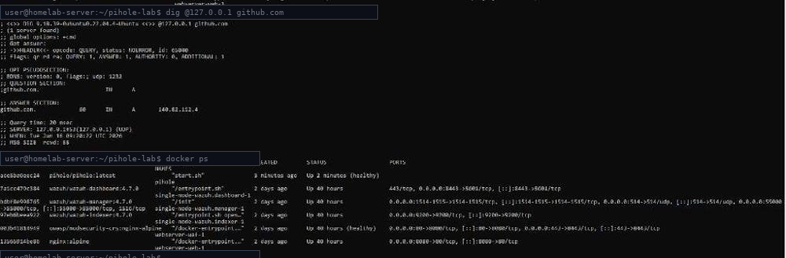
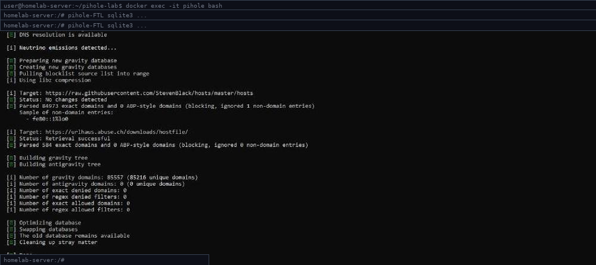
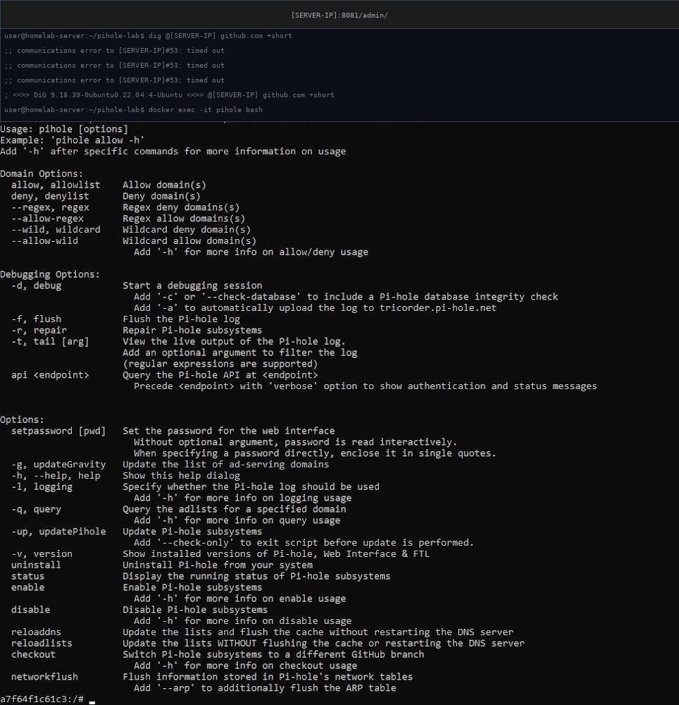
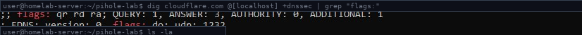
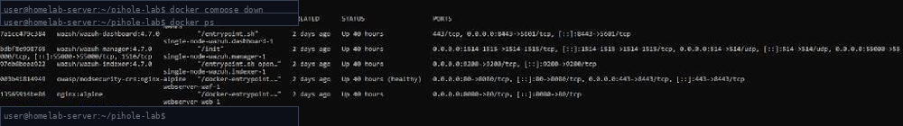
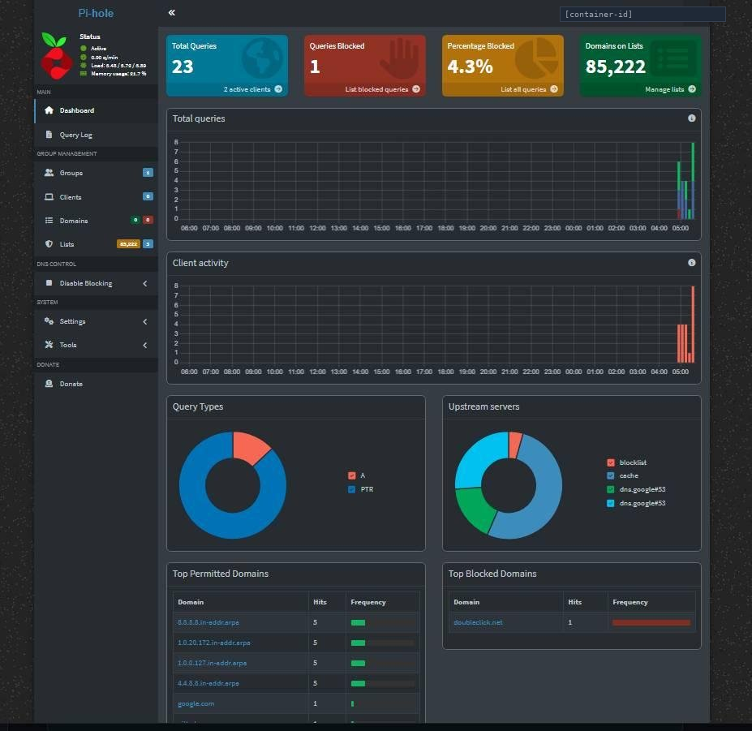

# Phase 1 — Deployment & Troubleshooting

Status: **Complete**

This document covers the full diagnosis and fix for each of the six
problems encountered deploying Pi-hole on a server that already runs a
Wazuh SIEM stack and a ModSecurity/Nginx WAF.

---

## Environment

- Host: Ubuntu Server 22.04 LTS
- Containerisation: Docker + Docker Compose
- Pi-hole: v6.x (`pihole/pihole:latest`)
- Upstream DNS: Cloudflare 1.1.1.1 + Google 8.8.8.8
- Pre-existing services: Wazuh SIEM, ModSecurity/Nginx WAF (ports 80/443 already in use)

---

## Problem 1 — YAML Syntax Error

**Error:**
```
yaml: while parsing a block collection at line 38, column 7:
line 42, column 7: did not find expected '-' indicator
```



`docker compose up -d` failed before any container started. YAML is
whitespace-sensitive — a misaligned entry under the `ports:` block, even by
two spaces, breaks the entire file.

**Fix:**
```bash
# Validate without starting anything
docker compose config

# If it errors, open the file and check indentation around the reported line
nano docker-compose.yml
```

Confirmed fixed when `docker compose config` printed the full parsed config
with no errors.

---

## Problem 2 — Port 80 Already Allocated

**Error:**
```
Error response from daemon: driver failed programming external
connectivity on endpoint pihole: Bind for 0.0.0.0:80 failed:
port is already allocated
```



The existing ModSecurity WAF lab's Nginx instance already owns host port 80.
Pi-hole's web dashboard also defaults to port 80 — two containers cannot
bind the same host port.

**Fix — remap Pi-hole's web UI to port 8081:**

```yaml
# Before (conflict)
ports:
  - "80:80/tcp"

# After (fixed)
ports:
  - "8081:80/tcp"
```

```bash
sudo ufw allow 8081/tcp comment "Pi-hole Web UI"
sudo ufw reload
```

---

## Problem 3 — Container Unhealthy, DNS Unavailable

**Symptoms:** Container showed `(unhealthy)` in `docker ps`. Logs showed "DNS
resolution is currently unavailable", "No DNS upstream set", and Pi-hole
generated a random password instead of reading `WEBPASSWORD` from the
environment.



**Root cause:** Two issues combined — a UID/GID mismatch between the
container and the Ubuntu host user prevented Pi-hole from writing to the
mounted `./volumes/` folders (blocking database/config creation), and the
container had no DNS available during its own startup health check.

**Fix:**

```yaml
environment:
  PIHOLE_UID: "1000"   # match your host user's UID — run `id -u` to confirm
  PIHOLE_GID: "1000"

dns:
  - 1.1.1.1
  - 8.8.8.8
```

```bash
# docker compose restart does NOT re-read environment changes —
# a full down + up is required
docker compose down
docker compose up -d
```

---

## Problem 4 — Pi-hole v6 CLI Command Removed

**Error:** Running `pihole -a adlist add <url>` inside the container
displayed the help menu instead of adding the blocklist — no error message,
just silent failure.



**Root cause:** The `-a adlist add` subcommand was removed entirely in
Pi-hole v6. Most online tutorials still reference the old v5 syntax.

**Fix — direct SQLite insert (the v6 method):**

```bash
docker exec -it pihole bash

pihole-FTL sqlite3 /etc/pihole/gravity.db \
  "INSERT INTO adlist (address, enabled, comment) VALUES \
  ('https://raw.githubusercontent.com/StevenBlack/hosts/master/hosts', 1, 'StevenBlack');"

pihole-FTL sqlite3 /etc/pihole/gravity.db \
  "INSERT INTO adlist (address, enabled, comment) VALUES \
  ('https://urlhaus.abuse.ch/downloads/hostfile/', 1, 'URLhaus');"

pihole -g
```



Result: 85,557 gravity domains processed (84,973 from StevenBlack, 584 from
URLhaus), 85,216 unique after deduplication.

---

## Problem 5 — Web UI Unreachable on Port 8081

**Error:** Browser showed `ERR_CONNECTION_TIMED_OUT` accessing
`http://<server-ip>:8081/admin` even after the port remap in Problem 2.



**Root cause:** UFW was active but only had rules for the original known
ports (22, 53, 80, 443). Port 8081 was never added, so connections were
dropped at the OS firewall level before reaching Docker.

**Fix:**

```bash
sudo ufw allow 8081/tcp comment "Pi-hole Web UI"
sudo ufw reload
sudo ufw status numbered
```

---

## Problem 6 — DNSSEC Set to True But Not Actually Validating

**Problem:** `DNSSEC: "true"` was set in the environment block, but running
the validation test showed the `ad` (Authenticated Data) flag was **absent**
from DNS responses — DNSSEC was declared in config but not functioning.

```bash
dig cloudflare.com @127.0.0.1 +dnssec | grep "flags:"
```



| Flag | Meaning | Present? |
|---|---|---|
| `qr` | Query Response | Yes |
| `rd` | Recursion Desired | Yes |
| `ra` | Recursion Available | Yes |
| `ad` | Authenticated Data (DNSSEC validated) | **No** |

**Root cause:** Setting `DNSSEC: "true"` in the environment block tells
Pi-hole's FTL resolver to request DNSSEC records, but does not fully
configure the underlying `dnsmasq` process to perform cryptographic
validation. An explicit dnsmasq config file is required.

**Fix:**

```bash
cat > ./volumes/pihole/etc-dnsmasq.d/99-dnssec.conf <<EOF
dnssec
dnssec-check-unsigned
EOF

docker compose down && docker compose up -d

# Verify
dig cloudflare.com @127.0.0.1 +dnssec | grep "flags:"
# Expected: flags: qr rd ra ad;   <- "ad" flag now present

dig dnssec-failed.org @127.0.0.1
# Expected: status: SERVFAIL      <- tampered DNSSEC correctly rejected
```

> **Key lesson:** Setting a security control and verifying it actually works
> are two different things. DNSSEC=true without the `ad` flag in responses
> provides zero protection against DNS spoofing or cache poisoning — it just
> looks correct in the config file. Always verify controls produce
> observable proof, not just a toggled setting.

This fix is already included in this repo at
[`volumes/pihole/etc-dnsmasq.d/99-dnssec.conf`](../volumes/pihole/etc-dnsmasq.d/99-dnssec.conf).

---

## Final Working State



After resolving all six problems, the existing Wazuh and ModSecurity WAF
containers continue running unaffected — confirmed via `docker compose down`
on Pi-hole followed by `docker ps`, showing the other services still healthy
and on their original ports.



- Container status: healthy
- DNS resolving and blocking correctly (`dig` confirms both allow and block cases)
- DNSSEC validating (`ad` flag confirmed)
- 85,222 domains on blocklist
- Dashboard live, 2 active clients, doubleclick.net confirmed in Top Blocked Domains

### Why "No ad blocking detected" was expected at this point


Pi-hole operates at the network DNS layer. Until a client device's DNS
setting is explicitly pointed at Pi-hole's IP, that device's queries never
reach Pi-hole — this is not a failure, it's confirmation that DNS-level
blocking requires the client to actually be using Pi-hole as its resolver.
This is exactly the limitation that Phase 2 addresses at the network level
instead of per-device.

→ Continue to [Phase 2 — Network Rollout](PHASE2-network-rollout.md)
